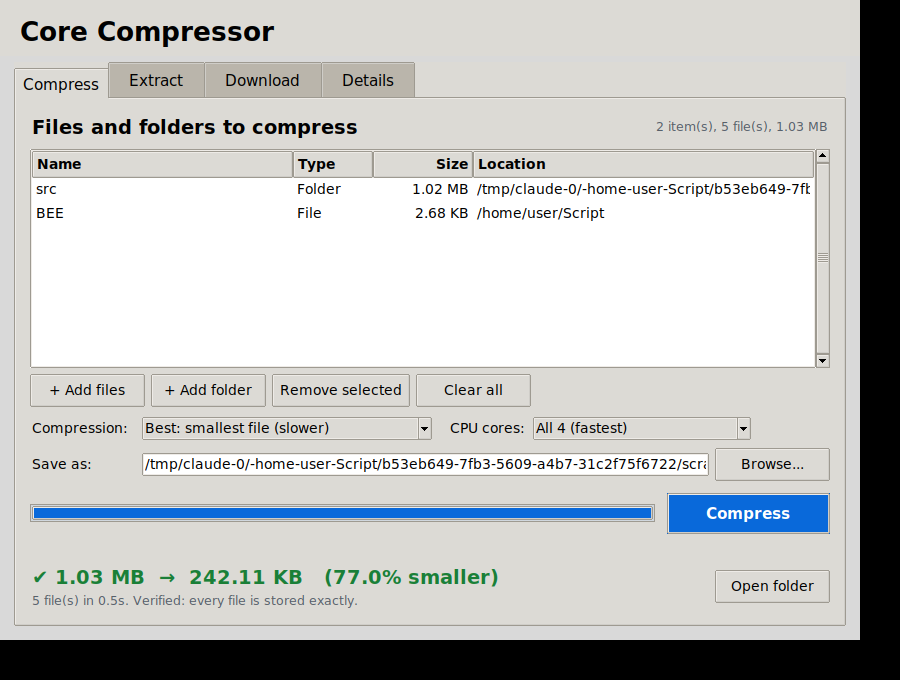

# Core Compressor

Packs files and folders into one smaller archive. When you extract it, every file comes back **byte-for-byte identical** to the original, so images keep every pixel and documents keep every detail.



## How to use

You need Python 3.8 or newer (get it from [python.org](https://www.python.org/downloads/)). Nothing else has to be installed.

**Open the window:** double-click **`Core Compressor.pyw`**. On Windows this opens without a black terminal window. On Mac or Linux, run `python3 core_compressor.py` instead.

**Compress tab**
1. Click **+ Add files** or **+ Add folder**. Add as many as you like; the list shows their sizes.
2. Pick a compression level. **Best** gives the smallest file; **Fast** is quicker but bigger.
3. Check where it will be saved (**Save as**), then click **Compress**.
4. A progress bar shows how far along it is, and you can **Cancel** at any time. When it finishes you see how much smaller it got, and **Open folder** takes you to the archive.

**Extract tab**
1. Click **Browse...** next to **Archive** and pick a `.tar.xz` file. The list shows what's inside.
2. Choose where to put the files (**Extract to**), then click **Extract**.
3. It checks every restored file and confirms that nothing was lost.

**Download tab**
1. Paste one or more links, one per line (the **Paste link** button pastes from your clipboard).
2. Click **Download & Compress**. It downloads each file to your computer and saves them all in one compressed, verified archive (in your Downloads folder unless you pick another place).
3. Tick **Also keep the uncompressed files** if you want the normal files as well.

Links that work:
- **Google Drive files** shared as "Anyone with the link" (large files too)
- **Google Docs, Sheets and Slides**, saved as Word, Excel and PowerPoint files
- **Dropbox** share links
- Any **direct download link**

Not supported: private files that need you to log in, and Google Drive *folder* links. For a folder, open it in Drive, select everything and click Download; Drive gives you a ZIP. Also, the file is downloaded at full size first and then compressed, so this saves space on your disk, not download time or data.

The **Details** tab lists every step if you want to see exactly what happened.

Optional: run `pip install tkinterdnd2` to also drag and drop files onto the window.

**From the command line:**

```
python core_compressor.py compress MyStuff.tar.xz photo.png "My Folder" notes.txt
python core_compressor.py compress MyStuff.tar.xz "My Folder" --level fast --threads 4
python core_compressor.py download MyDownloads.tar.xz "https://drive.google.com/file/d/.../view" --keep
python core_compressor.py list     MyStuff.tar.xz
python core_compressor.py extract  MyStuff.tar.xz  RestoredFolder
```

## Speed settings

- **CPU cores** (Compress and Download tabs): by default every core of your processor compresses at the same time. On a 4-core test machine that was about 3× faster than one core. Choose fewer cores if you want to keep using the computer smoothly while it works, or if it runs low on memory ("Best" uses about 200 MB per core).
- **Already-compressed data is detected automatically.** Videos, PNGs and most RAW photos are already compressed, so compressing them again takes ages and saves almost nothing. The program checks each piece and stores those pieces as they are. In testing this went from about 3–5 MB/s to about 85 MB/s, so on videos the speed now depends on your disk, not the CPU.
- **Fast download** (Download tab, on by default): downloads 3 files at the same time and splits each big file over 4 connections. On a 475 MB Google Drive file that was more than twice as fast as a normal download. Turn it off if a website complains or blocks you.
- **Graphics card:** not used. No GPU method makes this kind of lossless compression or downloading faster: downloads are limited by your internet connection, and the CPU tricks above give the real speed-up.

## Why nothing is lost

- It compresses with LZMA (`.tar.xz` at the strongest setting). LZMA is a lossless method, so it never throws data away.
- It saves a SHA-256 fingerprint of every file inside the archive. After compressing, it re-reads the archive and checks each file against its fingerprint. It does the same check again after extracting. If even one byte is different, you get an error.
- Folder structure, empty folders, file dates and permissions are kept.
- The archive is a standard `.tar.xz`, so 7-Zip, WinRAR and `tar` can also open it.

## How much smaller will it get?

That depends on what kind of file it is:

| File type | Typical savings |
|---|---|
| Text, scripts, code, logs, CSV, BMP/TIFF/WAV and other raw data | 50–90% |
| Documents (DOCX, PDF), PNG | 0–20% |
| JPG, MP4, MP3, ZIP, RAR, 7z | about 0% |

Formats in the last row are already compressed. No lossless tool can shrink them much further. To make those smaller you would need lossy re-encoding, and that is exactly what reduces quality.
