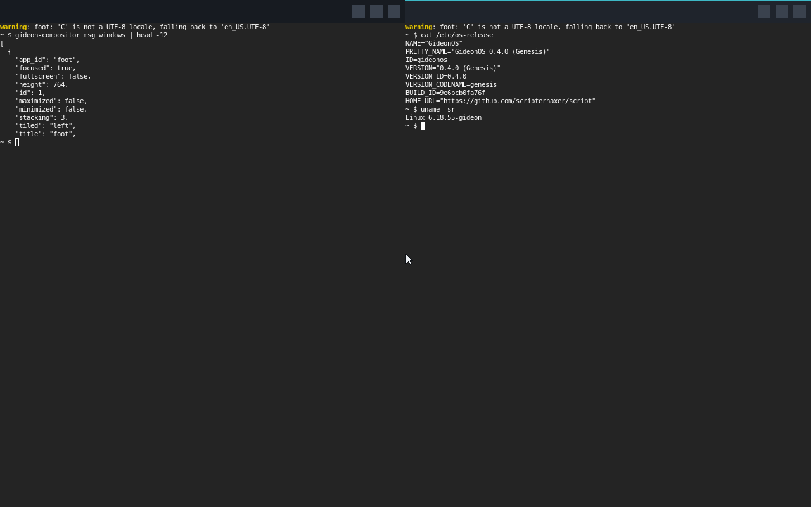

# GideonOS

GideonOS is a desktop operating system built on the Linux kernel, with its own userspace,
compositor, desktop shell, system applications, package format, update system and installer.
Linux and proven low-level components do the hard work (drivers, filesystems, networking,
Wayland); the experience on top is GideonOS's own.

**Current state: Milestone 4 — Gideon Compositor (GideonOS 0.4.0).** The ISO boots in
QEMU (BIOS and UEFI) from a read-only root image with systemd and logs the live user into
**gideon-compositor**, GideonOS's own Wayland compositor (Rust + Smithay) on DRM/KMS. It
provides decorated windows, move/resize, maximize/minimize/fullscreen, tiling, 9 workspaces,
multi-monitor, clipboard, screenshots and an IPC socket. The desktop shell (panel, launcher)
is the next milestone. See [docs/ROADMAP.md](docs/ROADMAP.md).



## Quick start

```sh
cd GideonOS
tools/check-deps.sh           # lists anything missing + the exact install command
tools/check-deps.sh --install # optional: install it for you (apt / dnf / pacman)

./build.sh                    # -> build/GideonOS.iso   (first build ≈ 1–1.5 h: Linux + Buildroot)
./run.sh                      # boot it in QEMU (window if available, else this terminal)
./run.sh --serial             # force serial console here; Ctrl-a x quits QEMU
./run.sh --uefi               # boot via UEFI firmware (OVMF)
./run.sh --outputs 2          # two virtual monitors
./build.sh test               # automated BIOS + UEFI system test (87 checks each)

# compositor development on a desktop Linux host (nested window), and its host test:
(cd components/compositor && cargo run --release --features winit)
make -C components/gfx-probe && (cd components/compositor && cargo build --release --features winit)
python3 tests/compositor_test.py
```

Desktop shortcuts: **Super+Enter** terminal · **Super+Q** / Alt+F4 close · **Super+Up/Down**
maximize/minimize · **Super+Left/Right** tile · **Super+F** fullscreen · **Super+1–9** workspace
(Shift: move window there) · **Super+Tab** / Alt+Tab cycle · **Print** screenshot to ~/Pictures ·
Super+drag move, Super+right-drag resize · Ctrl+Alt+F2 text console (Ctrl+Alt+F1 back).

The live user **`gideon`** is logged in automatically on the screen. Its password, needed on
the serial console, is `gideon`. Root cannot log in on a terminal; use `su` (root password
`gideon`). Useful commands inside the guest:

```sh
gideon-config list                      # effective configuration and where it comes from
su -c 'gideon-config set system.hostname mybox && gideon-config apply'
su -c 'gideon-config set display.mode 1024x768'   # applies at next session start
gideon-compositor msg windows           # compositor IPC (also: outputs, set-mode, screenshot …)
su -c 'gideon-user add alice --admin' && su -c 'gideon-user passwd alice'
gideon-session --list                   # logind sessions
systemctl status; journalctl -b         # services and logs
```

Shut down with `su -c poweroff` or the (virtual) power button.

## What's in the image

| Component | Version / source |
|---|---|
| Kernel | Linux 6.18.55 LTS, `x86_64_defconfig` + `config/kernel/gideon.config` |
| Userspace | Buildroot 2026.02.3 LTS: glibc, BusyBox, util-linux, shadow, PAM |
| Init | systemd 258 (udevd, logind, journald, networkd, resolved, timesyncd) |
| Graphics | Mesa 26.0, libdrm, Wayland 1.24, libinput, libxkbcommon |
| Desktop | gideon-compositor (Rust + Smithay 0.7), foot terminal |
| Early boot | initramfs with static BusyBox 1.37.0 (mounts the root image) |
| Root filesystem | read-only squashfs image + RAM overlay, mounted by our initramfs |
| Bootloader | GRUB 2, hybrid BIOS/UEFI ISO |

All sources are SHA-256 verified (`config/versions.env`). The build is designed to need no
root. Reproducibility is partial (see ARCHITECTURE §5).

## Layout

```
build.sh  run.sh     entry points
config/              version pins, kernel + BusyBox config fragments
boot/grub/           boot menu
system/rootfs/       files installed into the root filesystem (services, tools, defaults)
system/initramfs/    early-boot init that mounts the root image
system/buildroot/    Buildroot external tree: defconfig, GideonOS packages, image hooks
components/          GideonOS software (compositor, gfx-probe test client; desktop, apps next)
tools/               build stages, dependency checker
tests/               QEMU-driven integration tests
docs/                ARCHITECTURE.md · ROADMAP.md · DESIGN.md
build/               generated output (git-ignored)
```

## Documentation

* [docs/ARCHITECTURE.md](docs/ARCHITECTURE.md): layers, key decisions and their alternatives,
  build system, testing.
* [docs/ROADMAP.md](docs/ROADMAP.md): milestones M1–M13 with status and acceptance tests.
* [docs/DESIGN.md](docs/DESIGN.md): the "Meridian" design system (colour, type, spacing,
  decorations, motion, shortcuts).

## Development image warning

The live image's passwords are public (`config/live.conf`), it logs in automatically, and
nothing is sandboxed yet. It is for development and VMs only. See the security notes in
[docs/ARCHITECTURE.md](docs/ARCHITECTURE.md) (D10) for exactly what is implemented.
