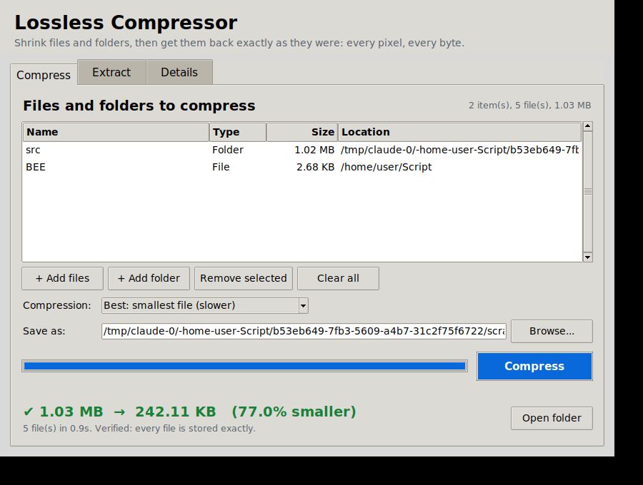

# Lossless Compressor

Packs files and folders into one smaller archive. When you extract it, every file comes back **byte-for-byte identical** to the original, so images keep every pixel and documents keep every detail.



## How to use

You need Python 3.8 or newer (get it from [python.org](https://www.python.org/downloads/)). Nothing else has to be installed.

**Open the window:** double-click **`Lossless Compressor.pyw`**. On Windows this opens without a black terminal window. On Mac or Linux, run `python3 lossless_compressor.py` instead.

**Compress tab**
1. Click **+ Add files** or **+ Add folder**. Add as many as you like; the list shows their sizes.
2. Pick a compression level. **Best** gives the smallest file; **Fast** is quicker but bigger.
3. Check where it will be saved (**Save as**), then click **Compress**.
4. A progress bar shows how far along it is, and you can **Cancel** at any time. When it finishes you see how much smaller it got, and **Open folder** takes you to the archive.

**Extract tab**
1. Click **Browse...** next to **Archive** and pick a `.tar.xz` file. The list shows what's inside.
2. Choose where to put the files (**Extract to**), then click **Extract**.
3. It checks every restored file and confirms that nothing was lost.

The **Details** tab lists every step if you want to see exactly what happened.

Optional: run `pip install tkinterdnd2` to also drag and drop files onto the window.

**From the command line:**

```
python lossless_compressor.py compress MyStuff.tar.xz photo.png "My Folder" notes.txt
python lossless_compressor.py compress MyStuff.tar.xz "My Folder" --level fast
python lossless_compressor.py list     MyStuff.tar.xz
python lossless_compressor.py extract  MyStuff.tar.xz  RestoredFolder
```

## Why nothing is lost

- It compresses with LZMA (`.tar.xz` at the strongest setting). LZMA is a lossless method, so it never throws data away.
- It saves a SHA-256 fingerprint of every file inside the archive. After compressing, it re-reads the archive and checks each file against its fingerprint. It does the same check again after extracting. If even one byte is different, you get an error.
- Folder structure, empty folders, file dates and permissions are kept.
- The archive is a standard `.tar.xz`, so 7-Zip, WinRAR and `tar` can also open it.

## How much smaller will it get?

That depends on what kind of file it is:

| File type | Typical savings |
|---|---|
| Text, scripts, code, logs, CSV, BMP/TIFF/WAV and other raw data | 50–90% |
| Documents (DOCX, PDF), PNG | 0–20% |
| JPG, MP4, MP3, ZIP, RAR, 7z | about 0% |

Formats in the last row are already compressed. No lossless tool can shrink them much further. To make those smaller you would need lossy re-encoding, and that is exactly what reduces quality.
